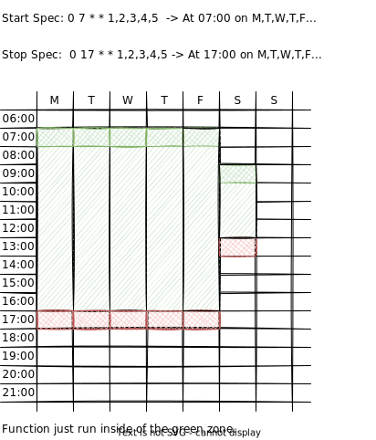

# hardloop

Hardloop is a cron time-based function runner.

Set start and end times as cron specs, and give function to run between them.

```shell
go get github.com/worldline-go/hardloop
```



## Usage

Check the https://crontab.guru/ to explain about cron specs.

You can give as much as you want start, stop times.

If stop time is not given, it will run forever.

If just stop time given, it will restart in the stop times.

```go
// Set start cron specs.
startSpecs := []string{
    // start at 7:00 in Monday, Tuesday, Wednesday, Thursday, Friday
    "0 7 * * 1,2,3,4,5",
    // start at 9:00 in Saturday
    "0 9 * * 6",
}
// Set stop cron specs.
stopSpecs := []string{
    // stop at 17:00 in Monday, Tuesday, Wednesday, Thursday, Friday
    "0 17 * * 1,2,3,4,5",
    // stop at 13:00 in Saturday
    "0 13 * * 6",
}

// Create a new schedule.
myFunctionLoop, err := hardloop.NewLoop(startSpecs, stopSpecs, MyFunction)
if err != nil {
    // wrong cron specs
    log.Fatal(err)
}

// Start the schedule.
wg := &sync.WaitGroup{}

// run forever in goroutine (or until the function returns ErrLoopExited)
myFunctionLoop.Run(context.Background(), wg)

wg.Wait()
```
